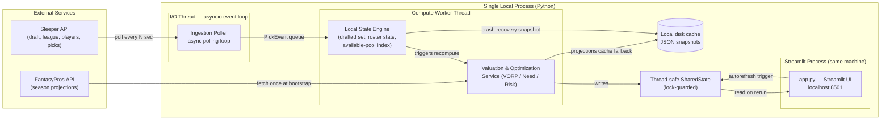
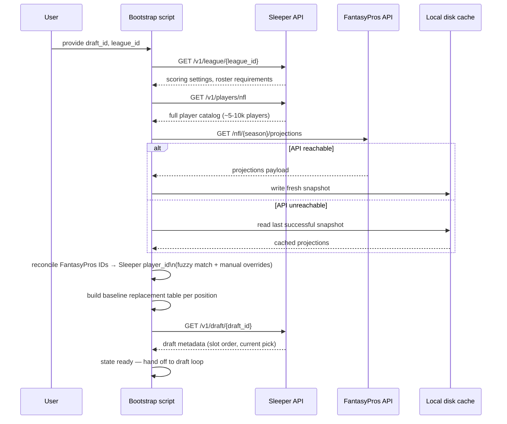

# Fantasy Football Draft Assistant — Architecture Specification

**Scope:** a real-time, low-latency draft assistant for a single user, run locally as a Streamlit app during a live snake draft on the Sleeper platform. "Production-ready" in this document means *reliable under a live pick clock* — survives network drops, recovers state after a crash, never blocks on a slow external call — not cloud infrastructure, auth, or multi-tenancy. See [Section 5](#5-technical-trade-offs--production-risks) for the explicit justification of staying local-only.

---

## 1. High-Level System Architecture & Component Topology

### 1.1 Component diagram



**Why this shape:** the poller is I/O-bound and must never stall waiting on compute; the valuation service is CPU-bound (vectorized recompute over hundreds of players) and must never stall waiting on network. Separating them onto an async I/O loop and a dedicated compute thread means a slow Sleeper response never delays a recommendation refresh, and a heavier recompute (e.g. after a multi-pick catch-up) never delays the next poll tick. They communicate through a single `SharedState` object guarded by a lock — the smallest amount of coordination that keeps both sides simple.

### 1.2 Execution lifecycles

**Bootstrap (cold start) — runs once, before the draft clock starts:**



**Steady-state draft loop — runs from bootstrap completion until the draft ends:**

```
┌─────────────────────────────────────────────────────────────┐
│  loop (async, I/O thread):                                   │
│    1. sleep(poll_interval)                                   │
│    2. GET /v1/draft/{draft_id}/picks                         │
│    3. diff against local drafted-ID set → new PickEvents     │
│    4. if new PickEvents: push onto compute queue              │
│    5. adapt poll_interval based on proximity to user's pick   │
└─────────────────────────────────────────────────────────────┘
                              │
                              ▼ (queue handoff, non-blocking)
┌─────────────────────────────────────────────────────────────┐
│  compute worker (separate thread):                           │
│    1. pop PickEvent(s) from queue                             │
│    2. update drafted-ID set + RosterState (drafter's roster)  │
│    3. recompute VORP for affected position(s) only            │
│    4. recompute Need for user's roster                        │
│    5. recompute survival probabilities for top-N candidates   │
│    6. write result into SharedState (lock-guarded)            │
│    7. snapshot state to disk cache (crash recovery)           │
└─────────────────────────────────────────────────────────────┘
                              │
                              ▼ (read on rerun, no push)
┌─────────────────────────────────────────────────────────────┐
│  Streamlit app (autorefresh every ~2s):                       │
│    1. read SharedState under lock                              │
│    2. render ranked table / roster panels / pick countdown    │
└─────────────────────────────────────────────────────────────┘
```

The draft loop is **event-driven on top of polling**: polling is the transport, but everything downstream (diffing, recompute, render) only fires when a diff is actually detected — an unchanged poll response does no work beyond the diff check.

### 1.3 Presentation layer — Streamlit specifics

Streamlit's execution model is a synchronous script rerun on every interaction or timer tick — it has no native background-async concept. This is the one real seam in the architecture and it's addressed directly rather than glossed over:

- The poller and compute worker run in a background thread started once, outside Streamlit's rerun cycle (guarded so `streamlit run`'s own script-rerun behavior doesn't restart them).
- State is hidden behind a small thread-safe `SharedState` class (a lock plus the latest computed view) — Streamlit never touches the poller/compute internals directly, it only reads the latest snapshot.
- `streamlit-autorefresh` (or a manual "Refresh" button as a zero-dependency fallback) triggers a rerun on a cadence tied to — but decoupled from — the poller interval; the UI refresh rate does not need to match the poll rate exactly, it just needs to be frequent enough that a new pick shows up within a second or two of being detected.

**Layout:**
- Ranked available-players table: player, position, tier, `Score = VORP × Need`, drop-off risk badge.
- User roster panel: starters filled/open by position, bench.
- Opponents' roster panel: compact per-team summary (used by the survival model's need-inference).
- "Your pick in ~N picks" countdown, driven off draft slot order and current pick number.

---

## 2. Data Schemas & Integration Contracts

### 2.1 Sleeper API contracts

| Endpoint | Purpose | Cardinality / size | Staleness | Notes |
|---|---|---|---|---|
| `GET /v1/draft/{draft_id}` | Draft metadata: slot order, draft type, current pick, status | Single object | Fetched once at bootstrap; `status`/`last_picked` re-checked cheaply during the loop | Confirms snake order and total rounds |
| `GET /v1/league/{league_id}` | League settings: scoring rules, roster requirements (starters/bench/flex counts) | Single object | Fetched once at bootstrap | Drives `ScoringSettings` and starting-slot counts used by VORP/Need |
| `GET /v1/players/nfl` | Global player catalog (all NFL players, ~5-10k) | Large (multi-MB JSON) | Changes slowly (injuries, roster moves) — fetch once per day, cache to disk, do **not** refetch per poll tick | This is the heaviest call by payload size; never call it inside the draft loop |
| `GET /v1/draft/{draft_id}/picks` | Live picks made so far | Grows by 1 per pick, ≤ (teams × rounds) | Polled every 2-5s during the active draft | The only endpoint hit repeatedly during the draft loop — diff against local state, don't trust ordering |

Sleeper does not publish a formal rate limit for this API; community guidance treats ~1000 requests/minute as a safe ceiling. A steady 2-5s poll of a single lightweight endpoint is well inside that — see [Section 4.2](#42-polling-cadence-rate-limits-retrybackoff) for the governance policy anyway, since "no documented limit" is not the same as "no limit."

### 2.2 Internal schemas (Pydantic v2)

```python
from __future__ import annotations
from enum import Enum
from pydantic import BaseModel, Field


class Position(str, Enum):
    QB = "QB"
    RB = "RB"
    WR = "WR"
    TE = "TE"
    K = "K"
    DST = "DST"


class ScoringSettings(BaseModel):
    """Derived from GET /v1/league/{league_id}."""
    reception_points: float          # 0.0 standard, 0.5 half-PPR, 1.0 PPR
    passing_td_points: float
    passing_yard_points: float
    rushing_td_points: float
    rushing_yard_points: float
    receiving_td_points: float
    interception_points: float       # typically negative


class RosterRequirements(BaseModel):
    """Starting-slot counts, from league settings."""
    starters: dict[Position, int]    # e.g. {RB: 2, WR: 2, QB: 1, TE: 1, ...}
    flex_slots: int                  # RB/WR/TE-eligible flex count
    flex_eligible: set[Position] = {Position.RB, Position.WR, Position.TE}
    bench_slots: int


class PlayerRecord(BaseModel):
    """One row in the available/drafted player pool."""
    player_id: str                   # Sleeper's player_id — the canonical join key
    full_name: str
    team: str
    position: Position
    tier: int | None = None          # from projections source, if provided

    projected_points: float          # from FantasyProsClient, joined at bootstrap
    replacement_points: float = 0.0  # recomputed live — Section 3.1
    vorp: float = 0.0                # recomputed live — Section 3.1
    need_multiplier: float = 1.0     # recomputed live — Section 3.2
    score: float = 0.0               # vorp * need_multiplier
    survival_probability: float | None = None  # Section 3.3, computed on demand for top candidates

    is_drafted: bool = False
    drafted_by_roster_id: int | None = None


class DraftSlotAssignment(BaseModel):
    """Maps a Sleeper roster/user to its position in snake order."""
    roster_id: int
    user_id: str
    draft_slot: int                  # 1-indexed position in the snake order
    is_self: bool = False            # True for the assistant's own user


class RosterState(BaseModel):
    """One team's roster as of the current point in the draft."""
    roster_id: int
    is_self: bool = False
    starters_filled: dict[Position, int] = Field(default_factory=dict)
    flex_filled: int = 0
    bench: list[str] = Field(default_factory=list)   # player_ids
    drafted_player_ids: list[str] = Field(default_factory=list)

    def open_starter_slots(self, requirements: RosterRequirements) -> dict[Position, int]:
        return {
            pos: max(0, requirements.starters.get(pos, 0) - self.starters_filled.get(pos, 0))
            for pos in requirements.starters
        }


class PickEvent(BaseModel):
    """One entry from GET /v1/draft/{draft_id}/picks."""
    pick_no: int                     # overall pick number, 1-indexed
    round: int
    draft_slot: int
    roster_id: int
    player_id: str
    picked_at: int                   # epoch millis, from Sleeper
```

### 2.3 Projections integration contract — `FantasyProsClient`

Sleeper has no projections endpoint, so `ProjectedPoints(player)` (used throughout [Section 3](#3-mathematical-formulation--optimization-models)) is sourced externally. Live API is primary, with an on-disk cache as fallback — chosen specifically so that a FantasyPros outage or network hiccup right before a draft degrades to "use last night's projections" rather than "bootstrap fails."

```python
import httpx
from pathlib import Path

class FantasyProsClient:
    BASE_URL = "https://api.fantasypros.com/public/v2/json"

    def __init__(self, api_key: str, cache_path: Path):
        self._api_key = api_key          # from FANTASYPROS_API_KEY env var — never hardcoded
        self._cache_path = cache_path

    async def get_season_projections(self, season: int) -> list[ProjectionRow]:
        try:
            resp = await self._fetch(season)
            rows = self._parse(resp)
            self._cache_path.write_text(rows_to_json(rows))
            return rows
        except (httpx.HTTPError, httpx.TimeoutException):
            if self._cache_path.exists():
                return json_to_rows(self._cache_path.read_text())
            raise  # no cache and no live data — bootstrap cannot proceed


class ProjectionRow(BaseModel):
    """Normalized shape — both the live API response and the disk cache map into this."""
    name: str
    team: str
    position: Position
    projected_points: float
```

**Confirmed contract details** (verified against FantasyPros' own docs):
- Base URL `https://api.fantasypros.com/public/v2/json`, endpoint `GET /nfl/{season}/projections`, auth via `x-api-key` header.
- Key loaded from the `FANTASYPROS_API_KEY` environment variable, populated via a local `.env` file that is gitignored from the repo's first commit — never hardcoded, never written into this document or committed to source control.

**Confirmed against a live authenticated call** (`GET /nfl/{season}/projections?position={QB|RB|WR|TE|K|DST}&week=draft&scoring={STD|HALF|PPR}`): response is `{"players": [...]}`; each player record has `name`, `team_id`, `position_id`, and a nested `stats` object carrying all three point totals simultaneously — `points` (standard), `points_ppr`, `points_half` — the `scoring` query param does not change which fields are present, the caller just picks the field matching the league's actual format. **Known gap surfaced by this call:** each position request returns a fairly small player list (no `limit`/pagination parameter is currently passed), leaving too thin a pool for a full 15-round draft — worth revisiting before relying on this for a real draft. Team defenses (DST) also frequently fail the name-reconciliation step in [Section 2.3](#23-projections-integration-contract--fantasyprosclient) as written (e.g. "Houston Texans" not matching Sleeper's DST naming) and need either a dedicated DST-matching rule or manual overrides.

**ID reconciliation:** FantasyPros' player identifiers don't share Sleeper's `player_id` space. At bootstrap, join `ProjectionRow.name/team/position` to `PlayerRecord.player_id` via fuzzy string match on name (handling suffixes like Jr./II, defensive/team-unit naming, and rookies not yet in one catalog or the other). Unmatched rows are **logged and reported**, not silently dropped — a silent join failure removes a real player from the entire draft pool, which is a correctness bug, not a cosmetic gap. A manual override map (`{provider_name: sleeper_player_id}`) covers the residual mismatches a fuzzy match can't resolve.

---

## 3. Mathematical Formulation & Optimization Models

### 3.1 Dynamic VORP (Value Over Replacement Player)

The naive approach picks a replacement rank once, at the start of the draft (e.g. "QB12 in a 12-team league"), and never revisits it. That's wrong in a live draft — the replacement level for a position moves as players at that position get drafted, and it moves *faster than proportionally* during a positional run, because a run pulls players off the board ahead of where their true value would otherwise place them.

```
Replacement_p(t) = ProjectedPoints( rank = R(p) + D(p, t), position = p )

VORP_p(player, t) = ProjectedPoints(player) − Replacement_p(t)
```

Where `R(p)` is the position's static baseline rank (roughly `teams × starters_per_team(p)`), and `D(p, t)` is the count of position-`p` players already drafted at time `t`. `Replacement_p(t)` is recomputed after **every** pick, not once — so a run at a position visibly reprices everyone left at that position, in real time.

**FLEX complication:** RB/WR/TE share a flex slot, so their replacement levels aren't independent of each other. Rather than computing three separate baselines, pool all flex-eligible players together, rank by value, and derive a blended replacement baseline across that pool — accounting for starting RB + WR + TE + FLEX slots leaguewide, minus what's already drafted across all of them.

### 3.2 Positional Need & Marginal Utility Penalty

Raw VORP answers "how much better than replacement" but not "how much does *this specific team* need it right now." A team that already has three startable RBs shouldn't see RB depth ranked the same as a team with zero.

```
Need_p(roster) = 1.0                          if open_starter_slots(roster, p) > 0
Need_p(roster) = decay ^ bench_count_at(p)    otherwise   (e.g. decay = 0.75)
```

Once a `RosterState`'s starting slots at position `p` are full (via `RosterState.open_starter_slots`), each additional player at `p` is discounted by a decay factor per extra copy already on the bench — not zeroed out, since bench depth still has value, just deprioritized relative to filling an open starting slot elsewhere. FLEX-eligible positions retain partial credit even after their own dedicated slots fill, since they can still occupy the shared FLEX slot.

### 3.3 Draft-Run & Drop-off Survival Model

This answers "if I pass on this player now, will they still be available at my next pick?" Given the snake order, if the user is on the clock at pick `N` and next picks again at `N + k`, there are `k` intervening opponent picks.

```
P(survive) = Π (1 − p_i)     for i = 1 .. k
```

`p_i` — opponent `i`'s probability of taking this exact player — is not uniform across opponents. It's driven by:
- That opponent's inferred positional need (from their `RosterState`: an opponent already starting 4 WRs is unlikely to take another).
- League-wide positional-run momentum: a recency-weighted signal over the last `m` picks (e.g. "4 of the last 5 picks were RBs" elevates RB run likelihood for everyone still to pick).
- Tier clustering: a tightly-grouped tier is likely to get raided as a whole even when no single player in it is any one opponent's clear individual target.

A workable first-pass estimate: `p_i ≈ (opponent i's need at position p) × (position p's current run rate) / (opponent i's count of viable targets at p)`, normalized so the probabilities across the available pool behave sensibly for each opponent.

The output is surfaced as a **drop-off risk tier** (e.g. "82% likely gone by your next pick") — a separate signal from the VORP × Need score, not folded silently into one number, because "best value" and "won't survive" are different decisions the user has to weigh against each other (take the safer, lower-value player now vs. gamble the higher-value one survives).

### 3.4 Putting it together

Each available player carries three independent outputs:

1. `VORP_p(t)` — dynamically recomputed value over the current replacement level.
2. `Need_p(roster)` — multiplicative positional-need discount for the user's own roster.
3. `P(survive)` — risk signal for the gap until the user's next pick.

```
Score(player, t) = VORP_p(player, t) × Need_p(user_roster)
```

`Score` drives the primary ranking. `P(survive)` is shown alongside as a sort/filter toggle rather than multiplied in — surfacing "reach now" candidates (moderate score, low survival probability) distinctly from the top of the raw-score list.

---

## 4. State Management & Low-Latency Compute Strategy

### 4.1 In-memory structures for sub-50ms recompute

```
┌────────────────────────────────────────────────────────────────┐
│  drafted_ids: set[str]                                          │
│    → O(1) membership check on every diff and every render pass  │
│                                                                   │
│  available_by_position: dict[Position, list[PlayerRecord]]      │
│    → kept sorted by `score` descending per position               │
│    → recompute touches only the position(s) affected by the      │
│      latest pick(s), not the full ~500-player available pool     │
│                                                                   │
│  full_pool: pandas.DataFrame (indexed by player_id)              │
│    → vectorized VORP/Need recompute via boolean-masked ops        │
│      over the affected position slice, not row-by-row iteration  │
│                                                                   │
│  roster_states: dict[roster_id, RosterState]                     │
│    → mutated in place on each PickEvent; feeds Need + survival    │
└────────────────────────────────────────────────────────────────┘
```

The key latency lever: a single pick only invalidates the replacement baseline for **one position** (or the flex-eligible pool, for RB/WR/TE). Recompute is scoped to that slice — a Pandas vectorized op over ~50-150 rows, not the full catalog — which is what keeps recompute comfortably under 50ms even on modest hardware.

### 4.2 Polling cadence, rate limits, retry/backoff

- **Adaptive interval**: baseline poll every ~4-5s; tighten to ~2s once the user is within a few picks of their turn (cheap to compute from draft slot order and current pick number), to minimize the perceived lag right when it matters most.
- **Retry/backoff**: transient failures (timeout, 5xx) retry with capped exponential backoff (e.g. 1s → 2s → 4s, cap at ~10s); the poll loop never blocks indefinitely — a failed tick just waits for the next scheduled poll rather than retrying in a tight loop.
- **Idempotent diffing**: never trust the picks endpoint to be strictly append-only or artifact-free. Diff the returned picks list against `drafted_ids` by `player_id`, not by list length or last index — this naturally handles duplicate entries and is unaffected by out-of-order arrival.
- **Reconnect-after-drop resync**: on reconnecting after a network drop, do a full refetch of `GET /v1/draft/{draft_id}/picks` (small payload — it's only picks made so far, not the full catalog) and diff wholesale against local state, rather than trying to resume from a remembered offset. This is simpler and correctness-safe: a full diff can't miss a pick that happened while disconnected.
- **Crash recovery**: rather than maintaining a separate local snapshot of draft state, recovery re-derives it — Sleeper's picks endpoint is already the durable source of truth and is cheap to refetch in full (small payload, just picks made so far). On restart mid-draft, bootstrap runs exactly as it does at cold start, then replays every pick already made by re-fetching `GET /v1/draft/{draft_id}/picks` and applying each one through the same idempotent `apply_pick` path used during live polling. This is simpler than snapshot/restore and can't drift from Sleeper's own state. (The on-disk cache in [Section 2.3](#23-projections-integration-contract--fantasyprosclient) still applies — that one exists because FantasyPros, unlike Sleeper, has no equivalent "just refetch it" story if the projections API is down at exactly the wrong moment.)

---

## 5. Technical Trade-offs & Production Risks

### 5.1 Polling vs. reverse-engineered WebSocket

Sleeper does not publish a public WebSocket API for draft events. Reverse-engineering their internal socket protocol (used by their own web client) would cut latency, but at real cost: undocumented, unversioned, likely to break silently on any client-side update, and a plausible ToS gray area. **Recommendation: polling.** A 2-5s poll interval is imperceptible against a 60-90s pick clock, and the durability of a documented public REST endpoint outweighs the latency win of an unsupported private socket.

### 5.2 In-memory state vs. persistent caching

Pure in-memory state means a crashed Streamlit process loses the entire draft's recomputed state and has to rebuild from scratch mid-draft — acceptable in a demo, not in something meant to be trusted live. **Resolution, refined during implementation:** rather than a separate local snapshot of draft state, recovery re-derives it directly from Sleeper — the picks endpoint is already durable and cheap to refetch in full, so a restart just re-runs bootstrap and replays every pick through the same idempotent `apply_pick` path the live poller uses (see [Section 4.2](#42-polling-cadence-rate-limits-retrybackoff)). This is simpler than snapshot/restore and can't drift from Sleeper's own state. The one place an on-disk cache *is* still needed is the FantasyPros projections fetch ([Section 2.3](#23-projections-integration-contract--fantasyprosclient)) — unlike Sleeper, FantasyPros has no "just refetch it" fallback if it's unreachable at exactly the wrong moment, so that cache remains. This is explicitly **not** a hosted-service concern either way — no multi-instance cache coherence to solve, just resilience for a single process on the user's own machine. SQLite would be a reasonable upgrade if the state model grows complex enough to want queries; it's not needed for the scope here.

### 5.3 Local single-process tool vs. hosted service

Single-user scope makes "local" the right default, not just the easy one: no auth surface to build or secure, no hosting cost or ops burden, no multi-tenant state isolation, and no network hop between the poller/compute layer and the UI (the local IPC via `SharedState` is strictly lower-latency than any hosted round trip would be). **Upgrade path, if scope ever expands to leaguemates using it concurrently:** per-user session isolation, a real datastore instead of local JSON, and an auth layer — none of which should be built now, since building for that scope prematurely is exactly the kind of complexity this tool doesn't need yet.

### 5.4 Rule-based heuristics vs. Monte Carlo simulation under the pick clock

A full Monte Carlo draft simulator (simulating opponent behavior forward to estimate true player value) produces better-calibrated recommendations in theory, but its compute cost is fundamentally in tension with a 60-90 second pick clock — a simulation heavy enough to be worth trusting risks not finishing before the user has to pick. **Recommendation:** the deterministic heuristic scoring in [Section 3](#3-mathematical-formulation--optimization-models) (VORP × Need, survival probability) is the primary, always-available path, computed well within the sub-50ms budget from [Section 4.1](#41-in-memory-structures-for-sub-50ms-recompute). A Monte Carlo enrichment can run as an optional background enhancement — never blocking the primary recommendation, and only surfaced if it finishes before the next pick event arrives.

---

## 6. Implementation Recommendations Summary

- **Stack:** Python 3.11+, `httpx` (async client) for both Sleeper and FantasyPros calls, `pydantic` v2 for all schemas, `pandas`/`numpy` for the vectorized valuation recompute, `streamlit` + `streamlit-autorefresh` for the UI.
- **Config/secrets:** `FANTASYPROS_API_KEY` via a local `.env` file (gitignored from the first commit — set up `.gitignore` before the first commit that touches secrets), never hardcoded or committed.
- **Build order:** (1) Sleeper client + Pydantic schemas, (2) bootstrap/cold-start including the FantasyPros client and ID reconciliation, (3) in-memory state engine + vectorized valuation, (4) draft loop wiring poller → compute → SharedState, (5) Streamlit presentation layer last, once the underlying engine is independently testable without a UI.
